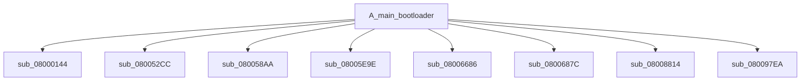

```mermaid
graph TD
  f8000174["A_main_bootloader"] --> f8000144["sub_08000144"]
  f8000174["A_main_bootloader"] --> f80052CC["sub_080052CC"]
  f8000174["A_main_bootloader"] --> f80058AA["sub_080058AA"]
  f8000174["A_main_bootloader"] --> f8005E9E["sub_08005E9E"]
  f8000174["A_main_bootloader"] --> f8006686["sub_08006686"]
  f8000174["A_main_bootloader"] --> f800687C["sub_0800687C"]
  f8000174["A_main_bootloader"] --> f8008814["sub_08008814"]
  f8000174["A_main_bootloader"] --> f80097EA["sub_080097EA"]
```
