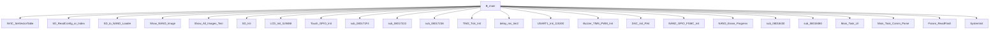

```mermaid
graph TD
  f8010144["B_main"] --> f8010374["NVIC_SetVectorTable"]
  f8010144["B_main"] --> f8014250["SD_ReadConfig_or_Index"]
  f8010144["B_main"] --> f8014702["SD_to_NAND_Loader"]
  f8010144["B_main"] --> f80148EA["Show_NAND_Image"]
  f8010144["B_main"] --> f8014946["Show_All_Images_Test"]
  f8010144["B_main"] --> f8014CFA["SD_Init"]
  f8010144["B_main"] --> f801555A["LCD_Init_ILI9488"]
  f8010144["B_main"] --> f8016A2C["Touch_GPIO_Init"]
  f8010144["B_main"] --> f80171F4["sub_080171F4"]
  f8010144["B_main"] --> f8017222["sub_08017222"]
  f8010144["B_main"] --> f801723A["sub_0801723A"]
  f8010144["B_main"] --> f801728C["TIM2_Tick_Init"]
  f8010144["B_main"] --> f801730E["delay_ms_tim2"]
  f8010144["B_main"] --> f801738A["USART1_Init_115200"]
  f8010144["B_main"] --> f8017520["Buzzer_TIM5_PWM_Init"]
  f8010144["B_main"] --> f80175C0["DAC_Init_PA4"]
  f8010144["B_main"] --> f801762C["NAND_GPIO_FSMC_Init"]
  f8010144["B_main"] --> f8017A82["NAND_Erase_Progress"]
  f8010144["B_main"] --> f8018430["sub_08018430"]
  f8010144["B_main"] --> f8018480["sub_08018480"]
  f8010144["B_main"] --> f801AD66["Main_Task_UI"]
  f8010144["B_main"] --> f801C3FC["Main_Task_Comm_Parse"]
  f8010144["B_main"] --> f801CF40["Param_ReadFlash"]
  f8010144["B_main"] --> f801D074["SystemInit"]
```
